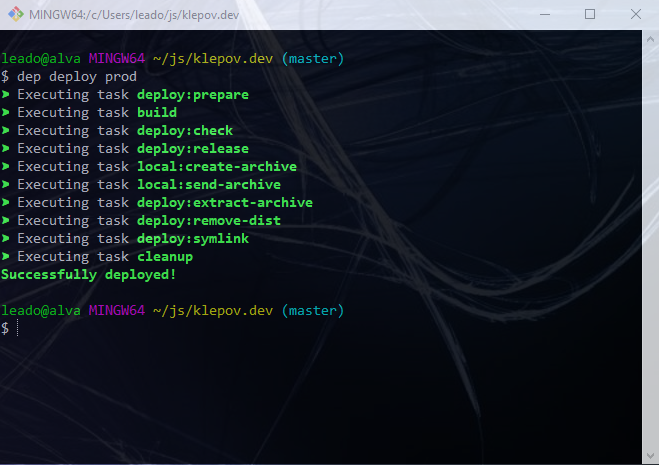
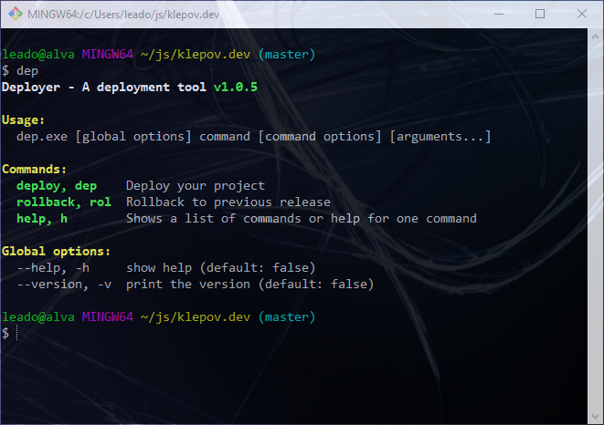

# Deploy
Программа для деплоя различных приложений через консоль по ssh.
В качестве консоле можно использовать любую консоль поддерживаю команды tar и ssh.
Работоспособность проверялась в git-bash на windows и консоле debian.

Для использования необходимо произвести настройку сервера и локальной машины, а также создать файл deploy.json c настройками для деплоя вашего приложения. Примеры настроек можно посмотреть в [директории с примерами](https://github.com/evgeny-klyopov/dep/tree/master/example).

## Как это работает
### [Основные команды](docs/COMMAND.md)
Деплой происходит после запуска команды, где prod - это название площадки из файла deploy.json.
```bash
dep deploy prod
```


Более подробно с командами можно ознакомится после вызова команды dep или dep --help
```bash
dep
```


Для дебага и демонстрации команд можно использовать флаг -d
```bash
dep deploy -d prod
```
Деплой происходит путем создания файла deploy.tar.gz и заливкой его на сервер по scp.

## Установка и настройка
### 1. [Настройка сервера](docs/SETTING_SERVER.md)
### 2. [Настройка локальной машины](docs/SETTING_LOCAL.md)
### 3. [Деплой](docs/DEPLOY.md)

## Миграции
Для миграций предлагаю использовать библиотеку [migrate](https://github.com/golang-migrate/migrate).
### Установка
```bash
wget https://github.com/golang-migrate/migrate/releases/download/v4.10.0/migrate.linux-amd64.tar.gz
tar -xvf migrate.linux-amd64.tar.gz
mv migrate.linux-amd64 /usr/bin/migrate
```
Для облегчения использования написал bash скрипт, который парсит файл .env и забирает настройки БД. В случае необходимости можно внести в него изменения в соответствии с вашей конфигурацией. ([пример моего файла](https://github.com/evgeny-klyopov/dep/blob/master/example/migrate/.env))
```bash
wget https://raw.githubusercontent.com/evgeny-klyopov/dep/master/example/migrate/mig
chmod u+x mig
mv mig /usr/bin/mig
```
### Раздача прав
```bash
chown deployer:deployer /usr/bin/migrate
chown deployer:deployer /usr/bin/mig
```
### Пример использования
В консоле:
```bash
mig up
mig down
```
Файл конфигурации
```json
{
  "keep_releases": 10,
  "hosts": [
    {
      "host": "test",
      "stage": "prod",
      "user": "deployer",
      "port": 1777,
      "deploy_path": "/var/www/projects/test/backend/production"
    }
  ],
  "local_object_path": ["test"],
  "tasks_order": [
    "deploy:check",
    "deploy:release",
    "local:create-archive",
    "local:send-archive",
    "deploy:extract-archive",
    "deploy:make-executable",
    "deploy:migrations",
    "deploy:symlink",
    "cleanup"
  ],
  "tasks" : {
    "remote": [
      {
        "name": "deploy:migrations",
        "command": "cd {{release_path}} && mig up"
      }
    ]
  }
}
```
## Переменные
Иногда возникает необходимость использовать различные переменные в командах. Например для билда приложения под конкретную площадку. Для этих целей в файле конфигурации можно использовать переменные в двойных фигурных скобках.
```json
{
    "tasks" : {
        "local": [
            {
                "name": "build",
                "command": "npm run build-{{stage}}"
            }
        ]
    }
}
```
### Доступные переменные
1. {{release_path}} - Симлинк для готовящегося релиза
2. {{stage}} - площадка